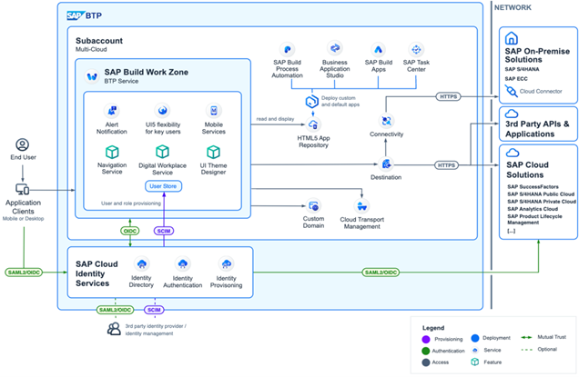
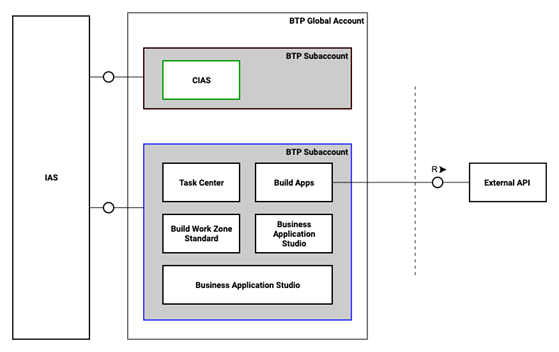
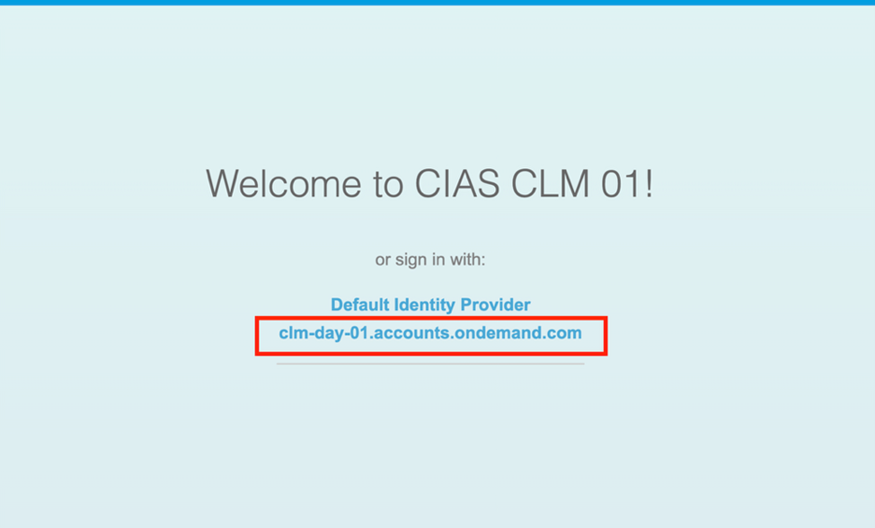

# Simplify SAP Build Integration Setup using Cloud Integration Automation Service

# Overview

This session introduces participants to the **Cloud Integration Automation Service**, where you will gain hands-on experience implementing an automated scenario Provisioning **SAP Build on SAP BTP**. After completing the setup, you can create and design a SAP Fiori Launchpad site using SAP Build Work Zone, standard edition.

**<ins>Scenario Description</ins>**

SAP Build is a comprehensive solution for business application development and automation. Designed for both low-code and pro-code users, SAP Build combines generative AI with prebuilt components to accelerate development and streamline collaboration across teams. Create cloud-ready extensions that enhance your cloud ERP and SAP and non-SAP application landscape while breaking down silos between business and IT.



**<ins>Configuration of the scenario with Cloud Integration Automation Service</ins>**

In this hands-on session, you will provision the following services on SAP Business Technology Platform. Setup the connectivity with the SAP Cloud Identity service and create the destination template for the external systems.

## Services Provisioned in SAP BTP

- SAP Build Work Zone (Standard Edition)
- SAP Build Process Automation
- SAP Build Apps
- SAP Task Center
- SAP Business Application Studio



## Required Systems & Services

- [x] __Cloud Integration Automation Service__: BTP Service used to set up the technical configuration of the integration scenario involving the below systems.
- [x] __SAP BTP Global Account__
- [x] __Cloud Identity Authentication Service__

## Access Information

You can log in to the above application/tenants with credentials assigned to you. 

1. __Username:__ Use the following email ID (`XX will be assigned to you during the hands-on exercise`)

    ```
    userXX@sapclm.org
    ```

4. __Password:__ Use the following password

    ```
    The password will be provided to you during the hands-on session
    ```

**NOTE:** While logging in to any of the above systems/tenants (**OPTIONAL**), select the **clm-day-01.accounts.ondemand.com** IDP (if prompted).



## Exercises

Run the following steps to complete the exercise

- [Exercise 1 - Overview of Cloud Integration Automation Service](ex1/README.md)
- [Exercise 2 - Generation of the workflow](ex2/README.md)
- [Exercise 3 - Monitoring Configuration Setup](ex3/README.md)

Once you complete the above exercises, you will be able to provision and configure services on BTP using Cloud Integration Automation Service and would be able create a fiori launchpad site in SAP Build Workzone


## Resources
1. [Cloud Integration Automation Service Discovery center](https://discovery-center.cloud.sap/serviceCatalog/cloud-integration-automation?region=all&service_plan=standard&commercialModel=cloud)
2. [SAP Help Portal](https://help.sap.com/docs/cloud-integration-automation/user-guide/overview?locale=en-US)
3. [SAP BTP Global Account](https://emea.cockpit.btp.cloud.sap/cockpit/?idp=clm-day-01.accounts.ondemand.com#/globalaccount/9d88d4f5-c80a-4986-8a56-dbf4b7b5a223) tenant used during the hands-on session.


## Code of Conduct
Please read the [SAP Open Source Code of Conduct](https://github.com/SAP-samples/.github/blob/main/CODE_OF_CONDUCT.md).

## How to obtain support
Support for the content in this repository is available during the actual time of the online session for which this content has been designed. Otherwise, you may request support via the [Issues](../../issues) tab.

## License
Copyright (c) 2023 SAP SE or an SAP affiliate company. All rights reserved. This project is licensed under the Apache Software License, version 2.0 except as noted otherwise in the [LICENSE](LICENSES/Apache-2.0.txt) file.
