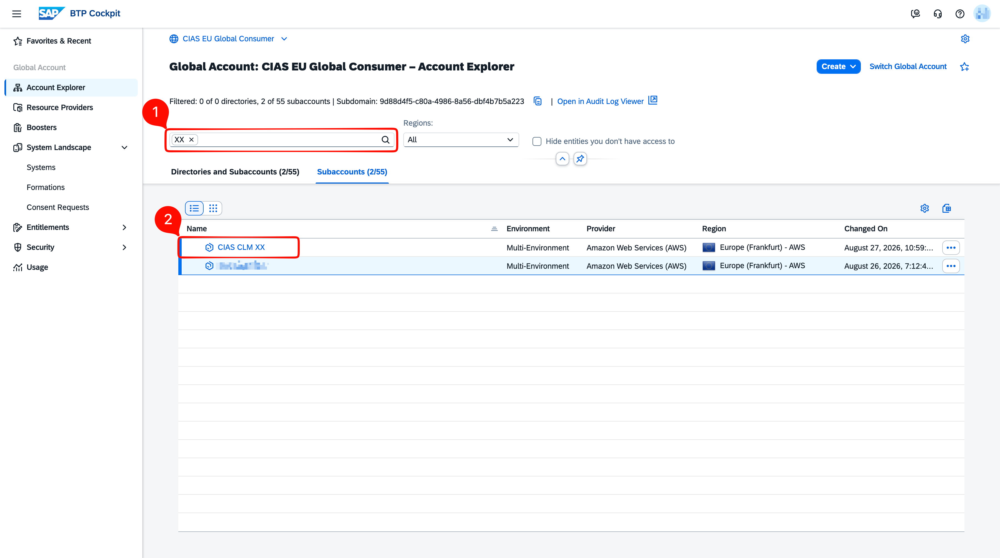
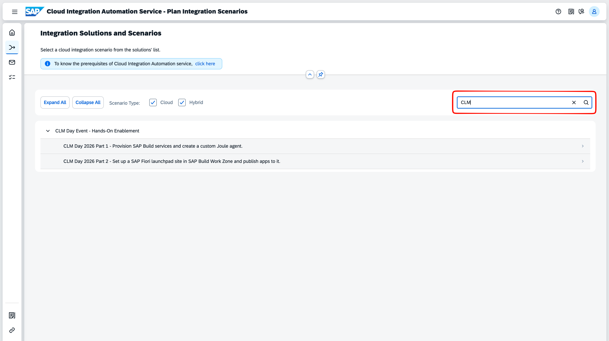
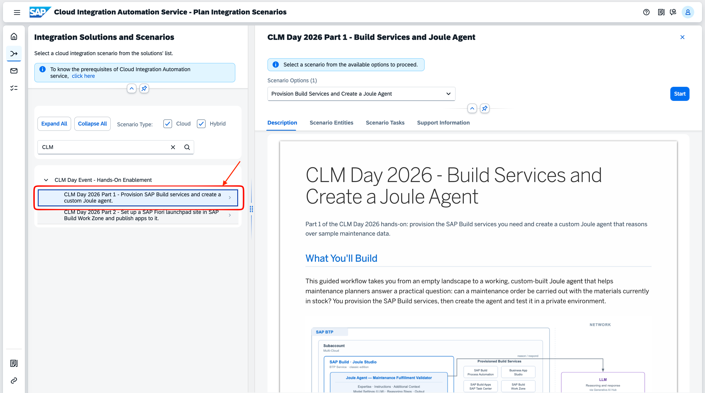
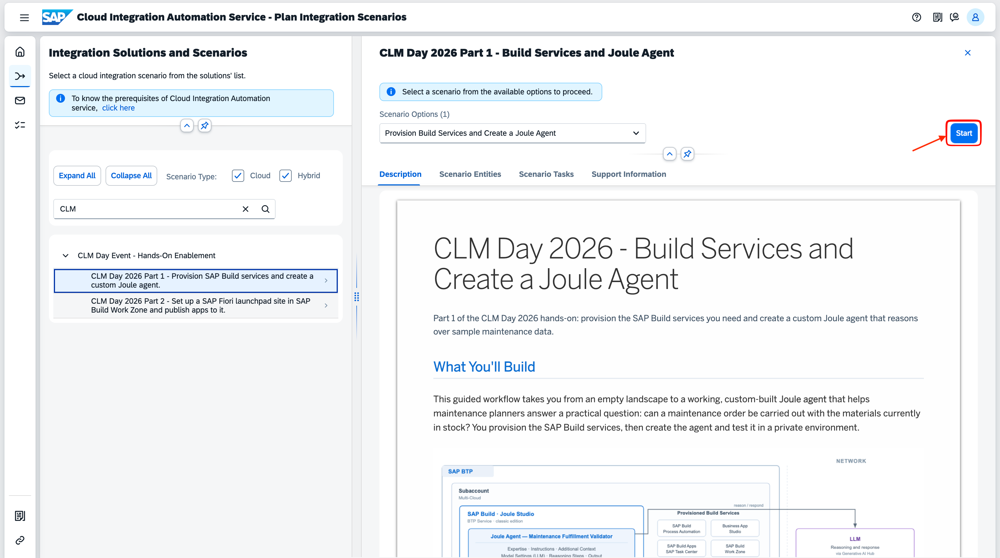
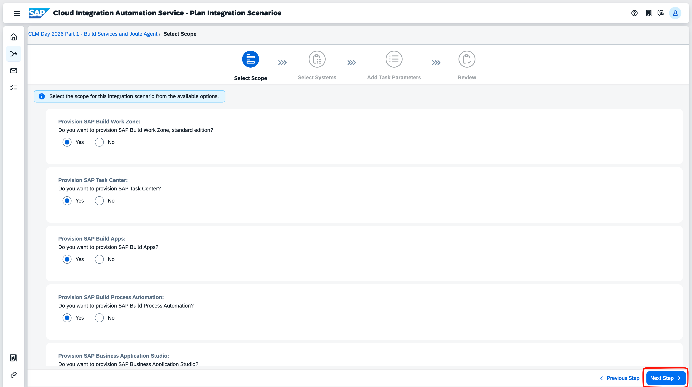
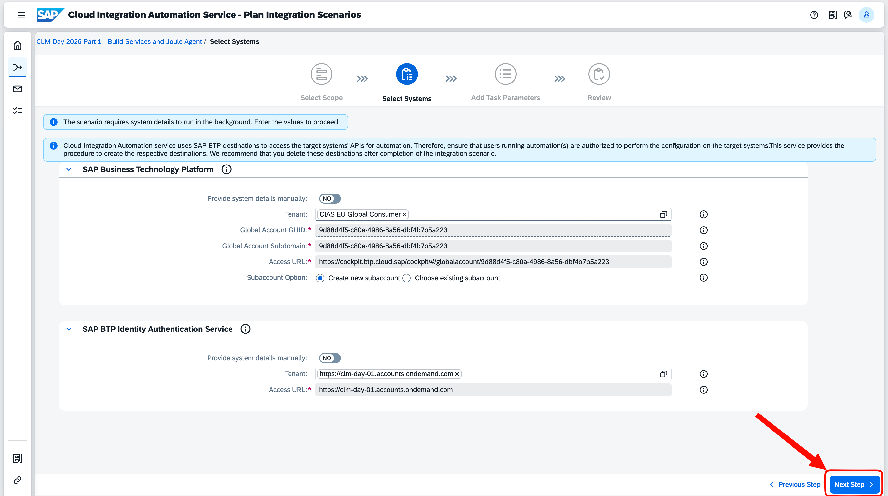
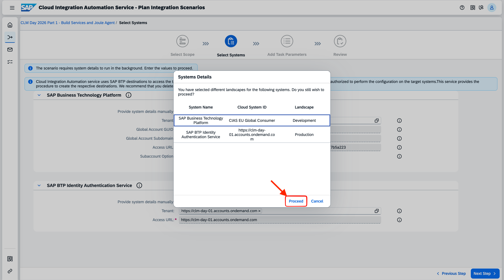
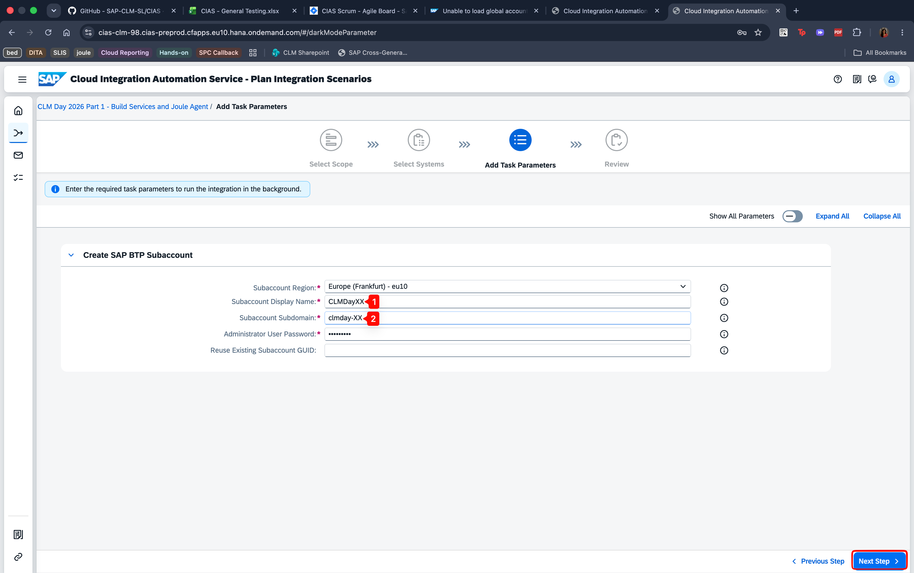
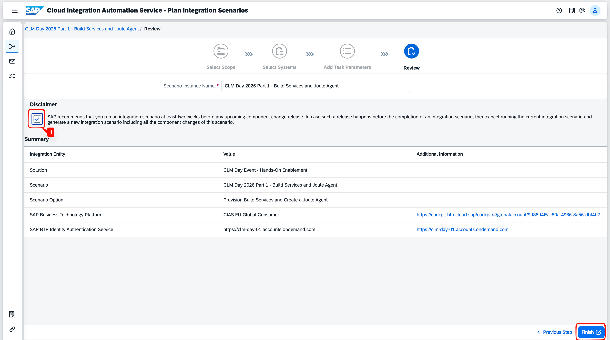
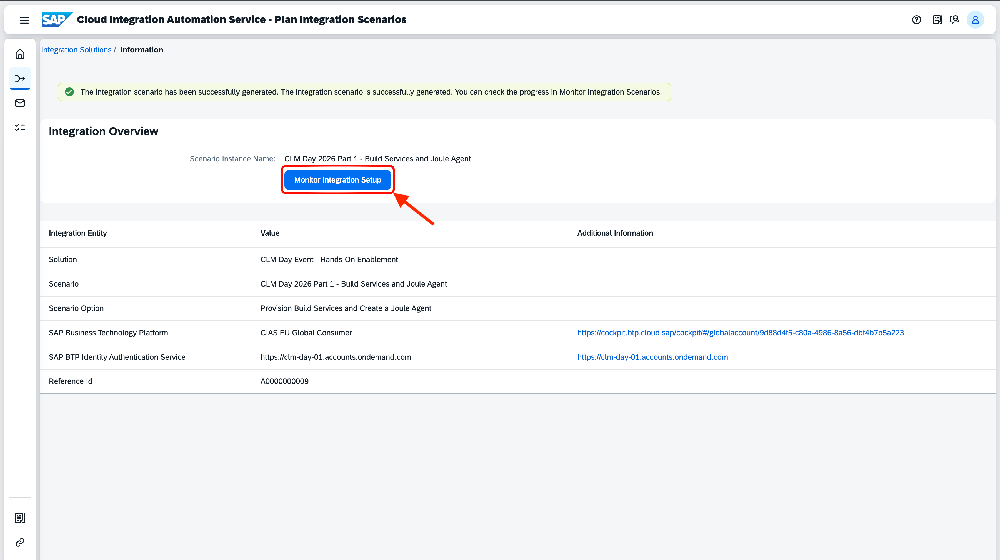

# Exercise 2 - Generation of Workflow
In this exercise, you will __generate a workflow__ for the Integration scenario - __CLM Day 2026 Part 1 - Build Services and Joule Agent__.

## Access the Cloud Integration Automation Service

* Click on the [BTP Global Account](https://emea.cockpit.btp.cloud.sap/cockpit/?idp=clm-day-01.accounts.ondemand.com#/globalaccount/9d88d4f5-c80a-4986-8a56-dbf4b7b5a223)
* Click on the Subaccount
  
* Click on **Services > Instances and Subscriptions**
* Click on the icon against Cloud Integration Automation service to launch the application
  

## Plan Integration Scenarios

1. On the CIAS home screen, select the **Plan Integration Scenarios** tile.

   

2. On the **Integration Solutions and Scenarios** page, search for **CLM** in the search box. The **CLM Day Event - Hands-On Enablement** solution appears with both 2026 scenarios listed.

   

3. Select **CLM Day 2026 Part 1 - Provision SAP Build services and create a custom Joule agent.** A panel opens on the right showing the scenario description and a **Scenario Options** dropdown.

   

4. In the **Scenario Options** dropdown, ensure **Provision Build Services and Create a Joule Agent** is selected, then click **Start**.

   

5. In the **Select Scope** step, choose **Yes** or **No** for each service you want to provision. At minimum, select **Yes** for **SAP Build Work Zone** (needed for Part 2) and **SAP Joule** (needed for the agent). Then click **Next Step**.

   > **Note:** Each scope item is independent. Select only the services your instructor advises if you are short on time.

   

6. In the **Select Systems** step, verify the pre-filled system details:
   - **SAP Business Technology Platform (1)**: Tenant should show **CIAS EU Global Consumer**. Use the toggle **(2)** to provide details manually if needed.
   - **SAP BTP Identity Authentication Service (3)**: Tenant should show **https://clm-day-01.accounts.ondemand.com**. Use the toggle **(4)** to provide details manually if needed.

   Click **Next Step**.

   

7. If a **Systems Details** popup appears warning about different landscapes, review the details and click **Proceed**.

   

8. In the **Add Task Parameters** step, provide the following values and keep the rest as-is:

   **Subaccount Display Name (1):** CLMDayXX

   **Subaccount Subdomain (2):** clmday-XX

   **Note** - replace **XX** with your user number. Click **Next Step**.

   

9. In the **Review** step, check the disclaimer checkbox **(1)**, review the summary, and click **Finish**.

   

## Result

You've now _successfully_ **generated the workflow**. The success screen shows your **Scenario Instance Name** and an **Integration Overview** summary. Click **Monitor Integration Setup** to navigate to the Monitor Integration Scenarios application and track progress.

In the next exercise, we will monitor the workflow execution and complete the integration setup.

**Continue to - [Exercise 3 - Monitoring Configuration Setup](../ex3/README.md)**
