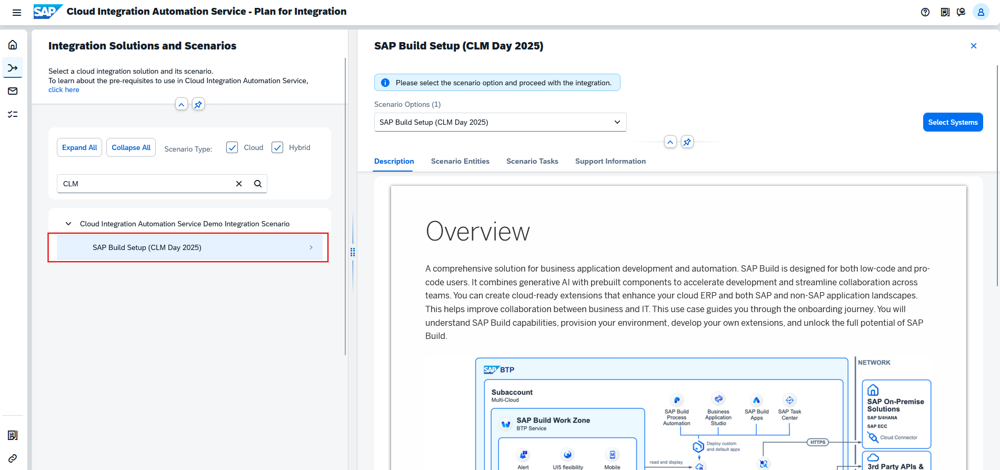
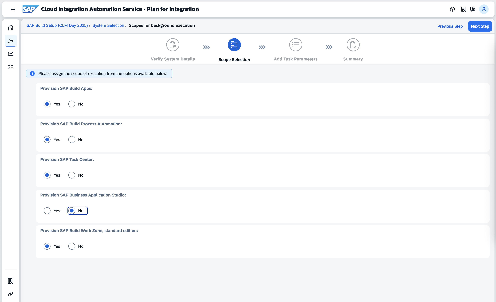

# Exercise 2 - Generation of Workflow
In this exercise, you will __generate a workflow__ for the Integration scenario - __SAP Build Setup (CLM Day 2025)__.

## Plan for Integration

Select the Plan for Integration tile in the Home screen of the CIAS application

1. Log in to __Cloud Integration Automation Service__ with your credentials.
   
   To log in to the service copy the link below and put it in the browser.
   
   __https://cias-clm-XX.cias-preprod.cfapps.eu10.hana.ondemand.com__ ( replace __XX__ with your user number )

2. Select the __Plan for Integration__ tile in the home screen of the Cloud Integration Automation Service application.
   

3. Search for **SAP Build Setup (CLM Day 2025)** integration scenario.

4. Select the line item. It will open up the side panel with more information about the integration scenario.

5. Click on the Select Systems button in the side panel
   

6.	Click on the **SAP Business Technology Platform** system tile and search **CIAS EU Global Consumer**, and choose the tenant from the table.

  
7.	Click on the **SAP BTP Identity Authentication Service** system tile and search **clm-day-01**, and choose the tenant from the below table.

8. Click the **Generate Workflow** button on the top right corner, and choose **Background Execution** option.

9.	Press the **Proceed** button in the popup. 

10. In **Verify System Details** screen, the selected system details can be verified and then press **Next Step** button. 

11. In the **Scope Selection** screen, the scope of the execution can be reviewed and then press **Next Step** button.

12. In the **Add Task Parameters** screen provide the values only for the below parameters and keep rest of the parameter values as is-:

**SAP Build Administrator** -: userXX@sapclm.org

**Subaccount Region** -: Europe Frankfurt eu10

**Subaccount Display Name** :  SAP CLM DAY USER XX 

**Subaccount Subdomain Name** – sap-clm-day-user-xx

**Note** - replace **XX** in above parameter values with your user number 

## Result

You've now _successfully_ **generated the workflow**. Now click on the link to navigate to Inbox.

In the next exercise, we will execute the workflow and complete the integration setup.

**Continue to - [Exercise 3 - Configuration Setup](../ex3/README.md)**
