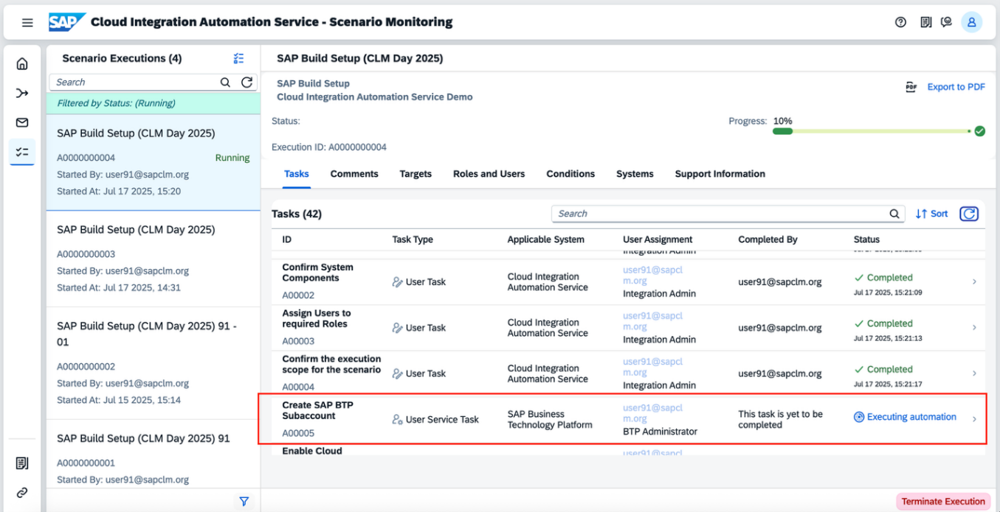
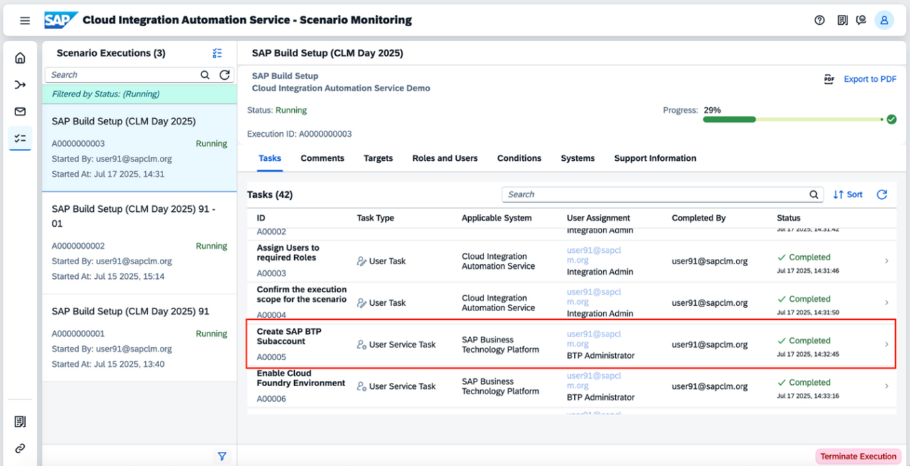
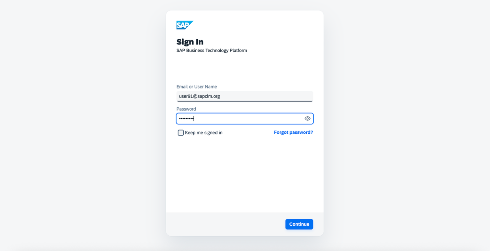
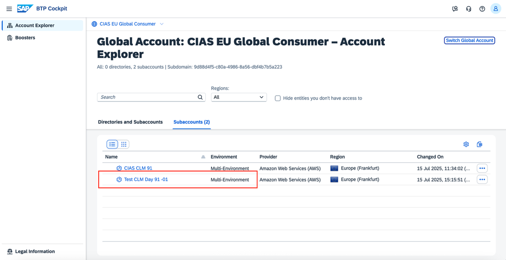
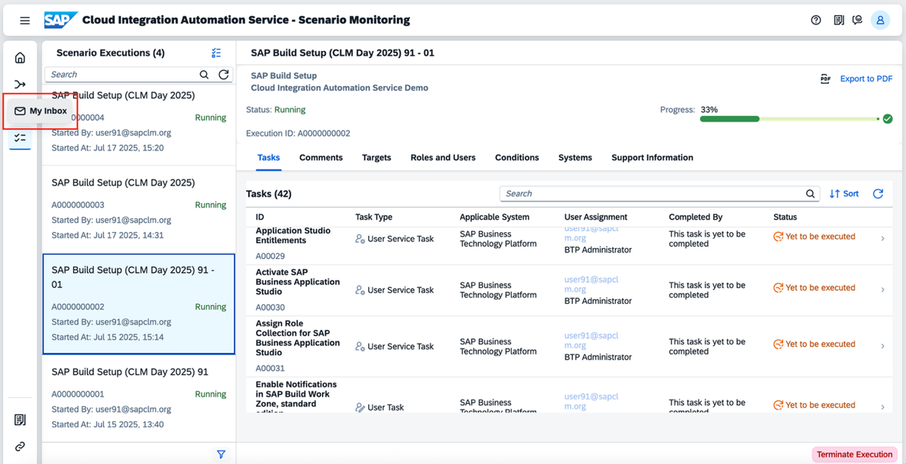

# Exercise 3 - Monitoring Configuration Setup
In this exercise, we will **monitor** the progress of the automated setup and verify the automations.

## Scenario Monitoring

Select the Plan for Integration tile in the Home screen of the CIAS application

1.	The real time status of the execution can be seen in this application. You can see that the task **Create SAP BTP Subaccount** is in status **Executing Automation**.
   

2.	Once the task **Create SAP BTP Subaccount** is in **Completed status**, a new subaccount would have been created in the SAP BTP Global Account- CIAS EU Global Consumer that you had previously selected in the Planning screen.
   
  

3.	To check the newly created subaccount, you can log in to the [SAP BTP Global Account- CIAS EU Global Consumer](https://emea.cockpit.btp.cloud.sap/cockpit/?idp=clm-day-01.accounts.ondemand.com#/globalaccount/9d88d4f5-c80a-4986-8a56-dbf4b7b5a223). The email and password is the same as mentioned in the Access Information. 

  

4.	You can see the newly created subaccount in the global account..

  

5.	In the **Scenario Monitoring** application, the following tasks will be executing sequentially. You can see the status in the Tasks table. Wait for the below listed tasks to be executed successfully.

   | Task ID      | Task Description                                              |
   |-----------|---------------------------------------------------------------|
   | A00005    | Create SAP BTP Subaccount                                     |
   | A00006    | Enable Cloud Foundry Environment                              |
   | A00007    | Create Space                                                  |
   | A00008    | Establish Trust with IAS                                      |
   | A00009    | Create Destination and XSUAA services                         |
   | A00010    | Disable Default IDP                                           |
   | A00011    | SAP Build Work Zone, standard edition Entitlement             |
   | A00012    | Activate SAP Build Work Zone, standard edition                |
   | A00013    | Assign Role Collection for SAP Build Work Zone, standard edition |
   | A00014    | SAP Build Work Zone, advanced edition Entitlement             |
   | A00015    | Activate SAP Build Work Zone, advanced edition                |
   | A00016    | Assign Role Collection for SAP Build Work Zone, advanced edition |
   | A00017    | Create Destination for SAP Build Work Zone Content            |
   | A00018    | SAP Task Center Entitlement                                   |
   | A00019    | Activate SAP Task Center                                      |
   | A00020    | Assign Role Collection for SAP Task Center                    |
   | A00021    | Create Destinations for SAP Task Center                       |
   | A00022    | SAP Build Apps Entitlement                                    |
   | A00023    | Activate SAP Build Apps                                       |
   | A00024    | Assign Role Collection for Build Apps                         |
   | A00025    | SAP Build Process Automation Entitlement                      |
   | A00026    | Activate SAP Build Process Automation                         |
   | A00027    | Assign Role Collection for SAP Build Process Automation       |
   | A00028    | Create Destinations for SAP Business Process Automation       |
   | A00029    | SAP Business Application Studio Entitlements                  |
   | A00030    | Activate SAP Business Application Studio                      |
   | A00031    | Assign Role Collection for SAP Business Application Studio    |

6.	Once all the above listed tasks are in **Completed** status, the task **Create a Site** will be in **Yet to be executed** status. Since it is a manual task, you need to now navigate to My Inbox application by clicking  on the icon in the left side pane, to execute the task manually. 

  
7.	In **My Inbox** app, the task **Create a Site** will be available . You need to now follow the steps provided in the Task Instructions. Once all the steps are done manually, you can click on **Task Completed** button to receive the next task.

## Result
After you have completed all the tasks, You’ve now _successfully_ **Created a Firoi Lanuchpad Site** in **SAP Build Work Zone**.

## Feedback 

It would be helpful if you could provide your feedback. You can scan the following QR code to provide feedback

**Continue to - [Home Page](../README.md)**
