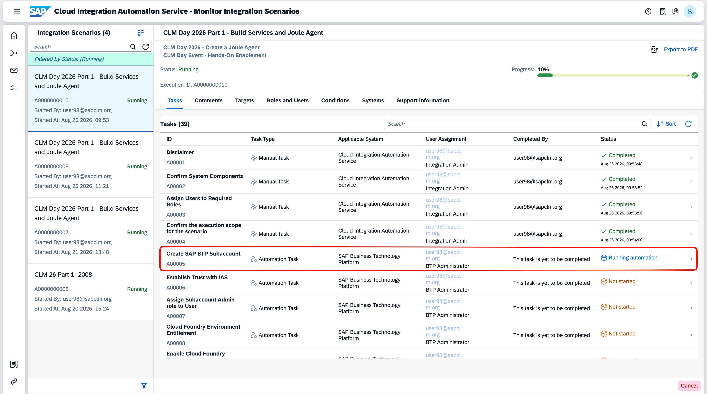
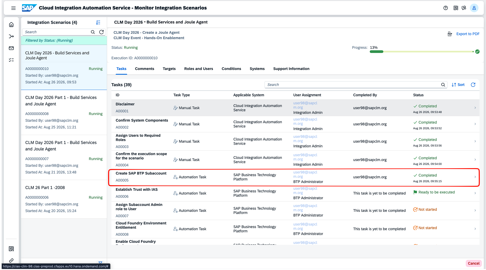
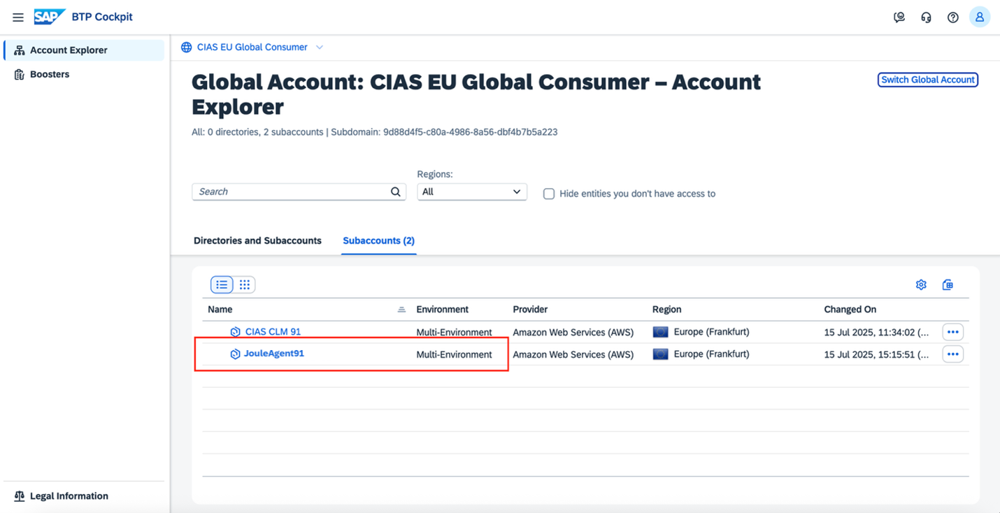

# Exercise 3 - Monitor and Complete the Setup
In this exercise, you will **monitor** the automated provisioning tasks, verify the newly created subaccount, and then complete the manual Joule agent tasks in My Inbox.

## Monitor Integration Scenarios

1. After generating the workflow in Exercise 2, you are taken to the **Monitor Integration Scenarios** application. Select your scenario instance in the left panel to view its task list. The **Tasks** table shows each task with its ID, type, applicable system, and current **Status**.

   You can see the first automation task — **Create SAP BTP Subaccount** (A00005) — with status **Running automation**.

   

2. Once **Create SAP BTP Subaccount** reaches **Completed** status, the next task becomes **Ready to be executed** and the automation continues automatically.

   

3. To verify the newly created subaccount, log in to the [SAP BTP Global Account - CIAS EU Global Consumer](https://emea.cockpit.btp.cloud.sap/cockpit/?idp=clm-day-01.accounts.ondemand.com#/globalaccount/9d88d4f5-c80a-4986-8a56-dbf4b7b5a223) using your assigned credentials.

   

4. In the BTP Cockpit, navigate to **Account Explorer**. You can see the newly created subaccount listed under **Subaccounts**.

   

5. Back in the **Monitor Integration Scenarios** application, the automation tasks run sequentially. Track progress in the **Tasks** table. Once all automated tasks are complete, navigate to **My Inbox** by clicking the inbox icon in the left navigation panel.

   

6. In **My Inbox**, the following tasks will be executing sequentially. Wait for all of them to reach **Completed** status before proceeding.

   | Task Description                                                          |
   |---------------------------------------------------------------------------|
   | Create SAP BTP Subaccount                                                 |
   | Establish Trust with SAP Identity Authentication Service                  |
   | Assign Subaccount Admin role to User                                      |
   | Cloud Foundry Environment Entitlement                                     |
   | Enable Cloud Foundry Environment                                          |
   | Create Space                                                              |
   | Create Destination and XSUAA services                                     |
   | Disable Default Identity Provider                                         |
   | SAP Build Work Zone, standard edition Entitlement                         |
   | Activate SAP Build Work Zone, standard edition                            |
   | Assign Role Collection for SAP Build Work Zone, standard edition          |
   | Assign Entitlements for SAP Task Center                                   |
   | Activate SAP Task Center                                                  |
   | Assign Role Collection for SAP Task Center                                |
   | Assign Entitlements for SAP Build Apps                                    |
   | Subscribe to SAP Build Apps                                               |
   | Assign Role Collection for SAP Build Apps                                 |
   | Assign Entitlements for SAP Build Process Automation                      |
   | Activate SAP Build Process Automation                                     |
   | Assign Role Collection for SAP Build Process Automation                   |
   | Create Destinations for SAP Business Process Automation                   |
   | Assign Entitlements for SAP Business Application Studio                   |
   | Subscribe to SAP Business Application Studio                              |
   | Assign Role Collection for SAP Business Application Studio                |
   | Assign Entitlements for Joule                                             |
   | Activate SAP Joule                                                        |
   | Set Up Joule and Joule Studio on SAP BTP                                  |
   | Assign Role Collection for Joule                                          |

> **Note:** If you selected **SAP_JOULE_AGENT = No** during scope selection, no manual tasks will appear and the workflow completes automatically.

## Create the Joule Agent

Once all automated tasks are complete, the **Create Maintenance Destination** task appears in **My Inbox**. The remaining tasks walk you through building the **Maintenance Fulfillment Validator** agent in Joule Studio — an agent that orchestrates five pre-built skills to check whether a maintenance order can be fulfilled based on current material stock levels.

| # | Task | Type | What you do |
|---|------|------|-------------|
| 1 | Create Maintenance Destination | Automation | Verify the pre-filled parameters and run the automation to create the connection to the sample maintenance backend |
| 2 | Enable AI Agent Builder Activation | Manual | Toggle on the AI Agent Builder in Joule Studio Control Tower |
| 3 | Create a Private Environment | Manual | Create a private test environment and bind the maintenance destination to it |
| 4 | Import Project with Skills | Manual | Upload the pre-packaged skills project (.mtar file) to the Joule Studio Lobby |
| 5 | Create Maintenance Fulfillment Validator Agent | Manual | Build the agent — enter the name, description, expertise, instructions, and add the five maintenance skills |
| 6 | Test in Private Environment | Manual | Send a prompt and inspect the Timeline to verify the agent returns a fulfillment answer |

For each task, open it in **My Inbox** and follow the **Task Instructions** tab — it contains all the steps, screenshots, and deep links you need. Choose **Complete Task** when done to move to the next one.

## Result

You have successfully provisioned the selected SAP Build services on SAP BTP and created a custom Joule agent that can validate maintenance order fulfillment.

> Want to know more about the data the agent queries? See [About the Sample Maintenance Backend](../info/README.md) for the data model and sample prompts.

**Continue to - [Home Page](../README.md)**
